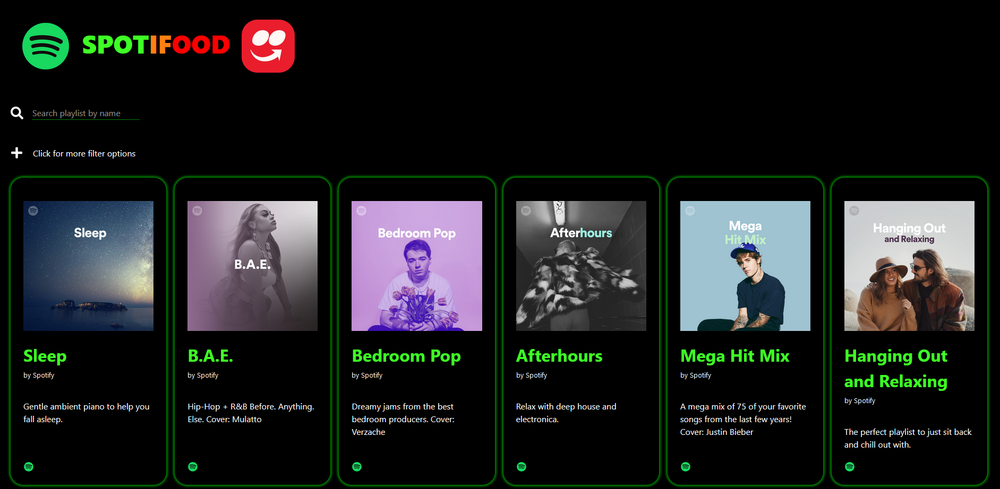
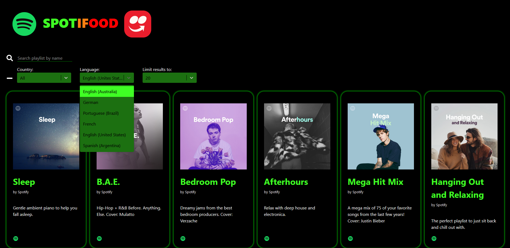
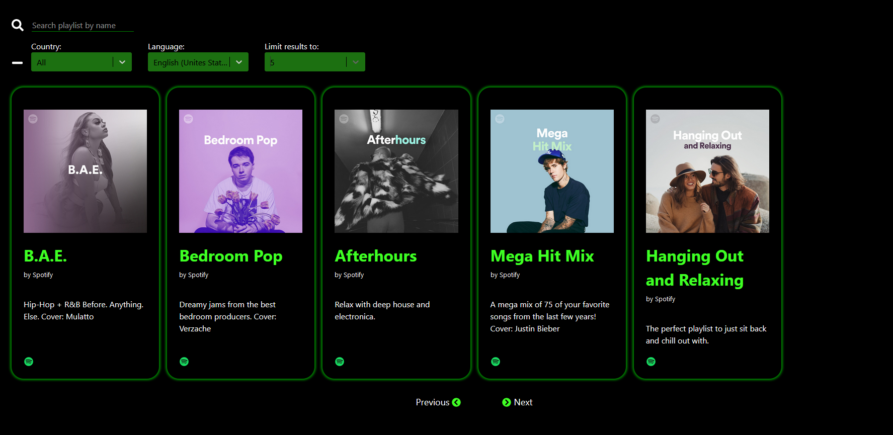

# SpotIfood
Use Spotify's API to list their featured playlists. Each playlist includes their image, title, owner, description and a link for it on Spotify Web.

It is possible to search playlists by their name.
It also features API filter options:
* Filter by Country
* Filter by locale (Language)
* Limit results per page
* Go to next or previous page, if available

It uses the system's date and time to filter by timestamp and provide playlists relevant to current time.

The API filter available options are consumed by a given API.

Spotify's API is called again every 30 seconds to maintain the results fresh.

## Developer's Warning
On the given API mentioned, the country that should represent United States has a value of "en_US", which is the locale.
This raises an error 400 on the API. I left as it is instead of correcting it hard-coded because that's what the API provides.
But I changed country and locale labels to more user-friendly ones.

# Usage
To make the code work, clone it and run

<code> npm install </code>

You should have a client ID and a client secret provided by Spotify.
Create a ".env" file on the root of the project and include them, as following:

<code>
REACT_APP_PRIVATE_KEY=abcdefgh123

REACT_APP_PUBLIC_KEY=abcdefgh123
</code>

Don't change these names.
Then, run

<code>npm start</code>

# Images

The landing page, containing featured playlists with their respective links to Spotify

Filters that can be applied

Pagination shows Next and Previous page

